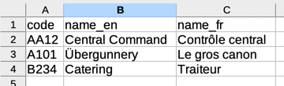
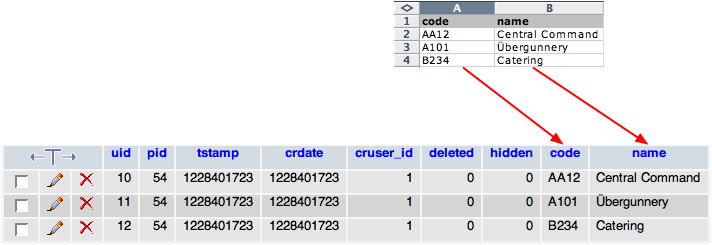

.. ==================================================
.. FOR YOUR INFORMATION
.. --------------------------------------------------
.. -*- coding: utf-8 -*- with BOM.

.. include:: ../../Includes.txt

.. _employees-import-departments:

The departments
^^^^^^^^^^^^^^^

Since the departments table does not exist inside TYPO3, we create it
with a full SQL statement and a full TCA definition. The SQL looks
like this:

.. code-block:: sql

   CREATE TABLE tx_externalimporttut_departments (
      code varchar(4) DEFAULT '' NOT NULL,
      name varchar(255) DEFAULT '' NOT NULL
   );

The TCA looks like this (with all the colums definition ommitted):

.. code-block:: php
   :emphasize-lines: 21-56

   $GLOBALS['TCA']['tx_externalimporttut_departments'] = [
       'ctrl' => [
           'title' => 'LLL:EXT:externalimport_tut/Resources/Private/Language/locallang_db.xlf:tx_externalimporttut_departments',
           'label' => 'name',
           'tstamp' => 'tstamp',
           'crdate' => 'crdate',
           'cruser_id' => 'cruser_id',
           'default_sortby' => 'ORDER BY name',
           'delete' => 'deleted',
           'enablecolumns' => [
               'disabled' => 'hidden',
           ],
           'transOrigPointerField' => 'l10n_parent',
           'transOrigDiffSourceField' => 'l10n_diffsource',
           'languageField' => 'sys_language_uid',
           'searchFields' => 'code, name',
           'typeicon_classes' => [
               'default' => 'tx_externalimport_tut-department'
           ]
       ],
       'external' => [
           'general' => [
               'english' => [
                   'connector' => 'csv',
                   'parameters' => [
                       'filename' => 'EXT:externalimport_tut/Resources/Private/Data/departments.txt',
                       'delimiter' => "\t",
                       'text_qualifier' => '"',
                       'skip_rows' => 1,
                       'encoding' => 'latin1'
                   ],
                   'data' => 'array',
                   'referenceUid' => 'code',
                   'whereClause' => 'tx_externalimporttut_departments.sys_language_uid = 0',
                   'priority' => 10,
                   'group' => 'externalimport_tut',
                   'description' => 'Import of all company departments (English, default language)'
               ],
               'french' => [
                   'connector' => 'csv',
                   'parameters' => [
                       'filename' => 'EXT:externalimport_tut/Resources/Private/Data/departments.txt',
                       'delimiter' => "\t",
                       'text_qualifier' => '"',
                       'skip_rows' => 1,
                       'encoding' => 'latin1'
                   ],
                   'data' => 'array',
                   'referenceUid' => 'code',
                   'whereClause' => 'tx_externalimporttut_departments.sys_language_uid = 1',
                   'priority' => 15,
                   'group' => 'externalimport_tut',
                   'description' => 'Import of all company departments (French translation)'
               ]
           ]
       ],
        ...
   ];

Note how the External Import configuration is defined at the same level
as the "ctrl" section. It contains a "general" part with the description of the
external source(s) from which the data will come. This general configuration
is itself an indexed array. Two indices are used (:code:`english` and :code:`french`),
because the import covers two languages.

The first property used above is "connector". This defines the sub-
type of connector service that is needed for connecting to and reading
data from the external source. In this case we are reading flat files,
so we request an instance of a connector service of sub-type "csv",
which is able to read such files.

Next is the "parameters" property. This is an array of values that are
passed to the connector. What values need to be defined is dependent
upon the sub-type of connector service. In the case of the "csv" sub-
type, the parameters include the name of the file to read, what
delimiter is used to separate the columns (a tab in this case), what
character is used to surround strings (a double quote in this case),
how many rows must be skipped off the top of the file (generally
because they contain header information, and it will generally be only
1 line) and – finally – what is the encoding of the file. This last
information will enable the CSV connector to convert the file's data
as appropriate if the file's charset does not match your BE's charset.

Then the "data" property indicates in what format the data will be
provided by the connector. "array" means that it will be a PHP array.
The "referenceUid" property indicates in which field from the
departments table the primary key from the external source will be
stored.

This is a critical information. Let's look at the contents of the
:file:`departments.txt` file:

	CSV data in the departments.txt file

Each department has a code. It is this code that makes a
department unique in the external data. If we want to be able to keep
track of which item in the external source is new, which has already
been imported at least once and which doesn't exist anymore, we have
to know what primary key is used in the external data and store it
internally, so that we can check it upon the next synchronisation.

Because we will import data in the default language and translations in two
separate imports, we use the "whereClause" property to restrict the selection
of records that we want to work with with a SQL condition on the "sys_language_uid"
field. Only records that match this condition will be considered by External
Import, i.e. only those records will be updated upon future imports, or
deleted if they are not present in the external data anymore. It is as if
we were handling records in different languages as completely different sets of
data, with no interference between them.

The next property is "priority". As was mentioned before, external
data needs to be imported in a precise order if relationships between
tables are to be preserved. The priority property takes care of that.
Lower priorities go first. Since employees are going to be related to
departments in a later import, we want to set a low number for the
import of departments. Furthermore, we want to import the default language
first (priority of 10) and the translation later (priority of 15)

Finally the "description" property is used to stored some useful
information about that particular configuration. This information will
be displayed in the BE module and is there only for reference. So make
it relevant.

The next step is to defined external information for each column.
Indeed this is where the real mapping takes places: which column in
the external data will fit into which field in the internal database.
This is how it looks for the departments table (columns configuration
only, with External Import-related part highlighted):

.. code-block:: php
   :emphasize-lines: 30-39,58-71,87-94,104-111

       'columns' => [
           'hidden' => [
               'exclude' => 1,
               'label' => 'LLL:EXT:core/Resources/Private/Language/locallang_general.xlf:LGL.hidden',
               'config' => [
                   'type' => 'check',
                   'default' => '0'
               ]
           ],
           'sys_language_uid' => [
               'exclude' => 1,
               'label' => 'LLL:EXT:core/Resources/Private/Language/locallang_general.xlf:LGL.language',
               'config' => [
                   'type' => 'select',
                   'renderType' => 'selectSingle',
                   'foreign_table' => 'sys_language',
                   'foreign_table_where' => 'ORDER BY sys_language.title',
                   'items' => [
                       [
                           'LLL:EXT:core/Resources/Private/Language/locallang_general.xlf:LGL.allLanguages',
                           -1
                       ],
                       [
                           'LLL:EXT:core/Resources/Private/Language/locallang_general.xlf:LGL.default_value',
                           0
                       ]
                   ],
                   'allowNonIdValues' => true,
               ],
               'external' => [
                   'french' => [
                       'field' => 'code',
                       'transformations' => [
                           10 => [
                               'value' => 1
                           ]
                       ]
                   ]
               ]
           ],
           'l10n_parent' => [
               'displayCond' => 'FIELD:sys_language_uid:>:0',
               'exclude' => 1,
               'label' => 'LLL:EXT:core/Resources/Private/Language/locallang_general.xlf:LGL.l18n_parent',
               'config' => [
                   'type' => 'select',
                   'renderType' => 'selectSingle',
                   'items' => [
                       [
                           '',
                           0
                       ]
                   ],
                   'foreign_table' => 'tx_externalimporttut_departments',
                   'foreign_table_where' => 'AND tx_externalimporttut_departments.pid=###CURRENT_PID### AND tx_externalimporttut_departments.sys_language_uid IN (-1,0)',
                   'default' => 0
               ],
               'external' => [
                   'french' => [
                       'field' => 'code',
                       'transformations' => [
                           10 => [
                               'mapping' => [
                                   'table' => 'tx_externalimporttut_departments',
                                   'referenceField' => 'code',
                                   'whereClause' => 'tx_externalimporttut_departments.sys_language_uid = 0'
                               ]
                           ]
                       ]
                   ]
               ]
           ],
           'l10n_diffsource' => [
               'config' => [
                   'type' => 'passthrough'
               ]
           ],
           'code' => [
               'exclude' => 0,
               'label' => 'LLL:EXT:externalimport_tut/Resources/Private/Language/locallang_db.xlf:tx_externalimporttut_departments.code',
               'config' => [
                   'type' => 'input',
                   'size' => 10,
                   'max' => 4,
                   'eval' => 'required,trim',
               ],
               'external' => [
                   'english' => [
                       'field' => 'code'
                   ],
                   'french' => [
                       'field' => 'code'
                   ]
               ]
           ],
           'name' => [
               'exclude' => 0,
               'label' => 'LLL:EXT:externalimport_tut/Resources/Private/Language/locallang_db.xlf:tx_externalimporttut_departments.name',
               'config' => [
                   'type' => 'input',
                   'size' => 30,
                   'eval' => 'required,trim',
               ],
               'external' => [
                   'english' => [
                       'field' => 'name_en'
                   ],
                   'french' => [
                       'field' => 'name_fr'
                   ]
               ]
           ],
       ],

First of all note that the same indices used in the "external" configuration for
column and in the general external configuration. This is
crucial. If the indices don't match the different bits of "external"
configurations will not know to which other bits they relate.

Now let's take a look at the import of the default language first, which is simpler.
In the configuration, this is the entries that correspond to index :code:`english`.

The departments table is quite simple and is comprised of only three
fields beyond the usual complement of TYPO3 fields (uid, pid, etc.).
The "hidden" field is not mapped to the external data. The "code"
field is mapped to a similarly named field in the external data (with
the "field" property). The "name" field is mapped to the "name_en" field
in the external data. Note how we use the names in the first row of the CSV file
to match data to map.

Let's move on to the import of translations, corresponding to index :code:`french`.
The same two fields are mapped, "code" and "name", only the source for "name" changes,
since it is mapped to the field named "name_fr" in the external data. But we need
more in the case of translations:

- in order for TYPO3 to know that the record is in a specific language, we need
  to set the value of the "sys_language_uid" field. In this example scenario, it is
  assumed that French has been defined as a system language and that it has a "uid"
  of 1 in the TYPO3 database. So we use the transformation property called "value"
  to hard-code a value of 1 upon import.

- we also need to relate the translation with its original in the default language.
  To do this, we map the "l10n_parent" field to the "code" field in the external data,
  and then use the possibility to match existing records in the database. This is the
  task of the "mapping" property. Using the "table" sub-property, we point to the
  departments table itself (since the original is in the same table). The "referenceField"
  sub-property is used to point to the field where the external key is stored
  (in this case, the "code" field from the external data). Just as with the general
  configuration, we restrict the selection of records using the "whereClause"
  property which also exists here. We restrict the selection to records in the default
  language, as only these can be used as originals of a translation.

At this point you can run the import of the departments table. The
result that you should have can be represented like this:

	Imported CSV data into the database
