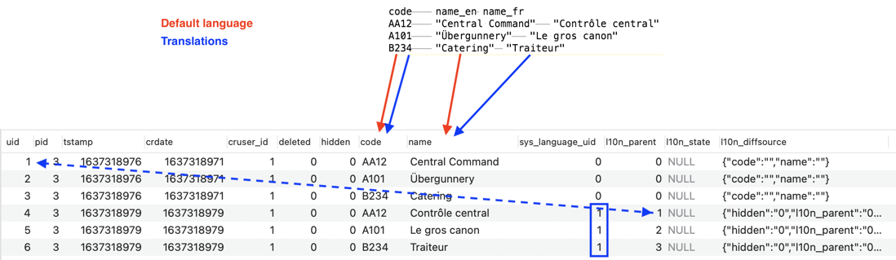

.. ==================================================
.. FOR YOUR INFORMATION
.. --------------------------------------------------
.. -*- coding: utf-8 -*- with BOM.

.. include:: ../../Includes.txt

.. _employees-import-departments:

The departments
^^^^^^^^^^^^^^^

Since the departments table does not exist inside TYPO3, we create it
with a full SQL statement and a full TCA definition. The SQL looks
like this:

.. code-block:: sql

	CREATE TABLE tx_externalimporttut_departments (
		uid int(11) NOT NULL auto_increment,
		pid int(11) DEFAULT '0' NOT NULL,
		tstamp int(11) DEFAULT '0' NOT NULL,
		crdate int(11) DEFAULT '0' NOT NULL,
		cruser_id int(11) DEFAULT '0' NOT NULL,
		deleted tinyint(4) DEFAULT '0' NOT NULL,
		hidden tinyint(4) DEFAULT '0' NOT NULL,
		code varchar(4) DEFAULT '' NOT NULL,
		name varchar(255) DEFAULT '' NOT NULL,

		PRIMARY KEY (uid),
		KEY parent (pid)
	);

and the TCA looks like this (without the "columns" section, which is
in the dynamic configuration file):

.. code-block:: php
   :emphasize-lines: 17-33

	$GLOBALS['TCA']['tx_externalimporttut_departments'] = [
           'ctrl' => [
                   'title' => 'LLL:EXT:externalimport_tut/Resources/Private/Language/locallang_db.xlf:tx_externalimporttut_departments',
                   'label' => 'name',
                   'tstamp' => 'tstamp',
                   'crdate' => 'crdate',
                   'cruser_id' => 'cruser_id',
                   'default_sortby' => 'ORDER BY name',
                   'delete' => 'deleted',
                   'enablecolumns' => [
                           'disabled' => 'hidden',
                   ],
                   'searchFields' => 'code,name',
                   'typeicon_classes' => [
                           'default' => 'tx_externalimport_tut-department'
                   ],
                   'external' => [
                           0 => [
                                   'connector' => 'csv',
                                   'parameters' => [
                                           'filename' => 'EXT:externalimport_tut/Resources/Private/Data/departments.txt',
                                           'delimiter' => "\t",
                                           'text_qualifier' => '"',
                                           'skip_rows' => 1,
                                           'encoding' => 'latin1'
                                   ],
                                   'data' => 'array',
                                   'referenceUid' => 'code',
                                   'priority' => 10,
                                   'group' => 'externalimport_tut',
                                   'description' => 'Import of all company departments'
                           ]
                   ]
           ],
	];

Compared to a traditional "ctrl" section, this TCA declaration
contains an "external" sub-section which is used to described the
external source from which the data will come. This external sub-
section is itself an indexed array (note index "0" in the TCA extract
above). Several indices are used when a table is synchronised with
multiple external sources. We will see with with the :code:`fe_users` table.

The first property used above is "connector". This defines the sub-
type of connector service that is needed for connecting to and reading
data from the external source. In this case we are reading flat files,
so we request an instance of a connector service of sub-type "csv",
which is able to read such files.

Next is the "parameters" property. This is an array of values that are
passed to the connector. What values need to be defined is dependent
upon the sub-type of connector service. In the case of the "csv" sub-
type, the parameters include the name of the file to read, what
delimiter is used to separate the columns (a tab in this case), what
character is used to surround strings (a double quote in this case),
how many rows must be skipped off the top of the file (generally
because they contain header information, and it will generally be only
1 line) and – finally – what is the encoding of the file. This last
information will enable the CSV connector to convert the file's data
as appropriate if the file's charset does not match your BE's charset.

Then the "data" property indicates in what format the data will be
provided by the connector. "array" means that it will be a PHP array.
The "referenceUid" property indicates in which field from the
departments table the primary key from the external source will be
stored.

This is a critical information. Let's look at the contents of the
:file:`departments.txt` file:

	CSV data in the departments.txt file

Each department has a code. It is this code that makes a
department unique in the external data. If we want to be able to keep
track of which item in the external source is new, which has already
been imported at least once and which doesn't exist anymore, we have
to know what primary key is used in the external data and store it
internally, so that we can check it upon the next synchronisation.

The next property is "priority". As was mentioned before, external
data needs to be imported in a precise order if relationships between
tables are to be preserved. The priority property takes care of that.
Lower priorities go first.

Finally the "description" property is used to stored some useful
information about that particular configuration. This information will
be displayed in the BE module and is there only for reference. So make
it relevant.

The next step is to defined external information for each column.
Indeed this is where the real mapping takes places: which column in
the external data will fit into which field in the internal database.
This is how it looks for the departments table (columns configuration
only, with External Import-related part highlighted):

.. code-block:: php
   :emphasize-lines: 19-23,33-37

        'columns' => [
                'hidden' => [
                        'exclude' => 1,
                        'label' => 'LLL:EXT:lang/locallang_general.xml:LGL.hidden',
                        'config' => [
                                'type' => 'check',
                                'default' => '0'
                        ]
                ],
                'code' => [
                        'exclude' => 0,
                        'label' => 'LLL:EXT:externalimport_tut/Resources/Private/Language/locallang_db.xlf:tx_externalimporttut_departments.code',
                        'config' => [
                                'type' => 'input',
                                'size' => 10,
                                'max' => 4,
                                'eval' => 'required,trim',
                        ],
                        'external' => [
                                0 => [
                                        'field' => 'code'
                                ]
                        ]
                ],
                'name' => [
                        'exclude' => 0,
                        'label' => 'LLL:EXT:externalimport_tut/Resources/Private/Language/locallang_db.xlf:tx_externalimporttut_departments.name',
                        'config' => [
                                'type' => 'input',
                                'size' => 30,
                                'eval' => 'required,trim',
                        ],
                        'external' => [
                                0 => [
                                        'field' => 'name'
                                ]
                        ]
                ],
        ],

The departments table is quite simple and is comprised of only three
fields beyond the usual complement of TYPO3 fields (uid, pid, etc.).
The "hidden" field is not mapped to the external data. The "code"
field is mapped to a similarly named field in the external data (with
the "field" property). The same goes for the "name" field. This
mapping is quite simple. We will see more complicated configurations
with the other tables. Note that the names used for the fields ("code"
and "name") match the names used in the first row of the file. This is
how fields from the file can be matched to columns from the database.

The important thing to note here is that the indices used in the
"external" configuration for each field match the indices used in the
"external" configuration found inside the "ctrl" section. This is
crucial. If the indices don't match the different bits of "external"
configurations will not know to which other bits they relate.

At this point you can run the import of the departments table. The
result that you should have can be represented like this:

	Imported CSV data into the database
