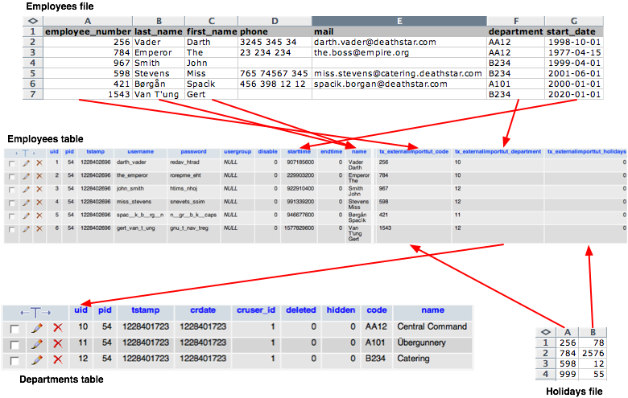
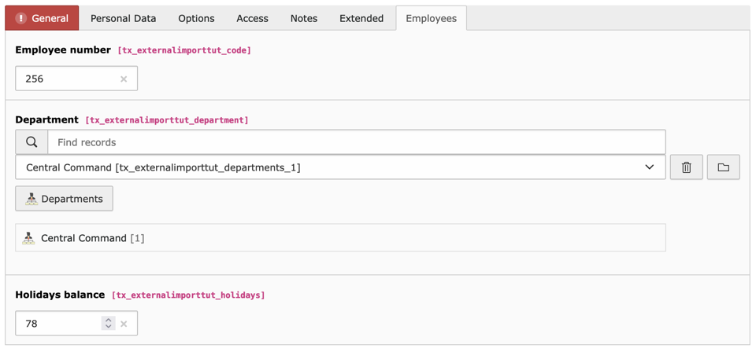
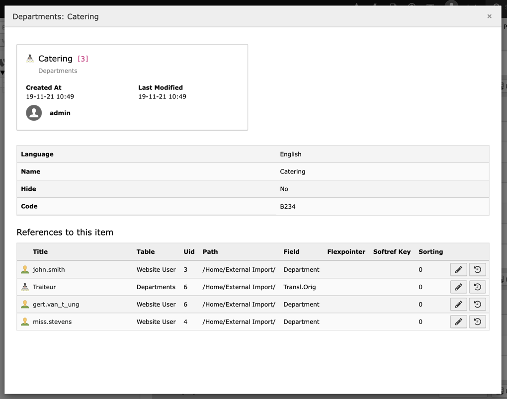

.. include:: /Includes.rst.txt

.. _employees-import-employees:

The employees (and their holidays)
^^^^^^^^^^^^^^^^^^^^^^^^^^^^^^^^^^

The list of employees will be stored in the :code:`fe_users` table, which
must be extended to add the necessary fields:

.. code-block:: sql

	CREATE TABLE fe_users (
      tx_externalimporttut_code varchar(10) default '' not null,
      tx_externalimporttut_department text,
      tx_externalimporttut_holidays int(11) default 0 not null
	);

These new columns are added to the TCA of the :code:`fe_users` table. At this
point we don't yet set the external data for these columns, as we will
do it later for all relevant columns. As this is a standard TCA
operation, it is not repeated here and can be simply looked up in the
:file:`Configuration/TCA/Overrides/fe_users.php` file.

Next we add the external information to the TCA of the
:code:`fe_users` table:

.. code-block:: php

   // Add the general external information
   $GLOBALS['TCA']['fe_users']['external']['general'] = [
        0 => [
             'connector' => 'feed',
             'parameters' => [
                  'uri' => 'EXT:externalimport_tut/Resources/Private/Data/employees.xml',
             ],
             'data' => 'xml',
             'nodetype' => 'employee',
             'referenceUid' => 'tx_externalimporttut_code',
             'priority' => 50,
             'group' => 'externalimport_tut',
             'disabledOperations' => '',
             'enforcePid' => true,
             'description' => 'Import of full employee list',
        ],
        1 => [
             'connector' => 'csv',
             'parameters' => [
                  'filename' => 'EXT:externalimport_tut/Resources/Private/Data/holidays.txt',
                  'delimiter' => ',',
                  'text_qualifier' => '',
                  'skip_rows' => 0,
                  'encoding' => 'utf8',
             ],
             'data' => 'array',
             'referenceUid' => 'tx_externalimporttut_code',
             'priority' => 60,
             'group' => 'externalimport_tut',
             'disabledOperations' => 'insert,delete',
             'description' => 'Import of holidays balance',
        ],
   ];
   // Add the additional fields configuration
   $GLOBALS['TCA']['fe_users']['external']['additionalFields'] = [
        0 => [
             'last_name' => [
                  'field' => 'last_name',
             ],
             'first_name' => [
                  'field' => 'first_name',
             ],
        ],
   ];

The first thing to note is that there are 2 external configurations in
this case. As was described in the description of the scenario, the
:code:`fe_users` users table will be synchronised with the employees list and
with a second file containing the balance of holidays.

In the first configuration, note how the "enforcePid" property is set to true
so that not all :code:`fe_users` records will be affected be the import process.
If some :code:`fe_users` are stored in a different page than the one where the
imported records are stored, those records will not be considered for updates or deletion.
This makes it possible to have several sources of :code:`fe_users` without interference with one another.

The first configuration also makes use of so-called "additional fields". These
are defined next to the "general" configuration and use the same indexed structure.
In the example above, it means that two fields from the external data
("last\_name" and "first\_name") will be read and made available all along the
import process, but will not be saved to the database. They are actually used to
assemble the user's full name and its password (see below).

In the second configuration, we make use of the "disabledOperations"
property. Indeed the holidays balance file will contain only
information about the number of holidays still available for each
employee. It does not contain complete information so it cannot be
used as a reference for creating new users. Hence the "insert"
operations is disabled. Since it is not a reference anyway, it does
not make sense to allow this particular synchronisation to delete
users. So the "delete" operation is also disabled.

Finally we set the external configuration for each column that will
receive external data.

.. code-block:: php
   :emphasize-lines: 1-42,61-105,112-154

   $GLOBALS['TCA']['fe_users']['columns']['name']['external'] = [
        0 => [
             'field' => 'last_name',
             'transformations' => [
                  10 => [
                       'userFunction' => [
                            'class' => \Cobweb\ExternalimportTut\Transformation\NameTransformation::class,
                            'method' => 'assembleName',
                       ],
                  ],
             ],
        ],
   ];
   $GLOBALS['TCA']['fe_users']['columns']['username']['external'] = [
        0 => [
             'field' => 'last_name',
             'transformations' => [
                  10 => [
                       'userFunction' => [
                            'class' => \Cobweb\ExternalimportTut\Transformation\NameTransformation::class,
                            'method' => 'assembleUserName',
                            'parameters' => [
                                 'encoding' => 'utf8',
                            ],
                       ],
                  ],
             ],
        ],
   ];
   $GLOBALS['TCA']['fe_users']['columns']['starttime']['external'] = [
        0 => [
             'field' => 'start_date',
             'transformations' => [
                  10 => [
                       'userFunction' => [
                            'class' => \Cobweb\ExternalImport\Transformation\DateTimeTransformation::class,
                            'method' => 'parseDate',
                       ],
                  ],
             ],
        ],
   ];
   $GLOBALS['TCA']['fe_users']['columns']['tx_externalimporttut_code']['external'] = [
        0 => [
             'field' => 'employee_number',
        ],
        1 => [
             'field' => 0,
        ],
   ];
   $GLOBALS['TCA']['fe_users']['columns']['email']['external'] = [
        0 => [
             'field' => 'mail',
        ],
   ];
   $GLOBALS['TCA']['fe_users']['columns']['telephone']['external'] = [
        0 => [
             'field' => 'phone',
        ],
   ];
   $GLOBALS['TCA']['fe_users']['columns']['company']['external'] = [
        0 => [
             'transformations' => [
                  10 => [
                       'value' => 'The Empire',
                  ],
             ],
        ],
   ];
   $GLOBALS['TCA']['fe_users']['columns']['title']['external'] = [
        0 => [
             'field' => 'rank',
             'transformations' => [
                  10 => [
                      'userFunction' => [
                          'class' => \Cobweb\ExternalimportTut\Transformation\CastTransformation::class,
                          'method' => 'castToInteger',
                      ],
                  ],
                  20 => [
                       'mapping' => [
                            'valueMap' => [
                                 1 => 'Captain',
                                 2 => 'Senior',
                                 3 => 'Junior',
                            ],
                       ],
                  ],
             ],
             'excludedOperations' => 'update'
        ]
   ];
   $GLOBALS['TCA']['fe_users']['columns']['tx_externalimporttut_department']['external'] = [
        0 => [
             'field' => 'department',
             'transformations' => [
                  10 => [
                       'mapping' => [
                            'table' => 'tx_externalimporttut_departments',
                            'referenceField' => 'code',
                            'whereClause' => 'tx_externalimporttut_departments.sys_language_uid = 0',
                       ],
                  ],
             ],
        ],
   ];
   $GLOBALS['TCA']['fe_users']['columns']['tx_externalimporttut_holidays']['external'] = [
        1 => [
             'field' => 1,
        ],
   ];
   $GLOBALS['TCA']['fe_users']['columns']['image']['external'] = [
        0 => [
             'field' => 'picture',
             'transformations' => [
                  10 => [
                       'userFunction' => [
                            'class' => \Cobweb\ExternalImport\Transformation\ImageTransformation::class,
                            'method' => 'saveImageFromBase64',
                            'parameters' => [
                                 'storage' => '1:imported_images',
                                 'nameField' => 'name',
                                 'defaultExtension' => 'jpg',
                            ],
                       ],
                  ],
             ],
             'children' => [
                  'table' => 'sys_file_reference',
                  'columns' => [
                       'uid_local' => [
                            'field' => 'image',
                       ],
                       'uid_foreign' => [
                            'field' => '__parent.id__',
                       ],
                       'title' => [
                            'field' => 'name',
                       ],
                       'tablenames' => [
                            'value' => 'fe_users',
                       ],
                       'fieldname' => [
                            'value' => 'image',
                       ],
                  ],
                  'controlColumnsForUpdate' => 'uid_local, uid_foreign, tablenames, fieldname',
                  'controlColumnsForDelete' => 'uid_foreign, tablenames, fieldname',
             ],
        ],
   ];

Several columns have more interesting configurations than the
departments table described previously. They have been highlighted.
The first three fields will use a user function. The user
functions are defined using a "class" property and a "method"
property. Additional parameters can be passed to the function using
the "parameters" property. So what happens for these three fields?

1. For the "name" field, a method called :code:`assembleName()` will be
   called, from a class defined in this tutorial extension. Let's look at
   what this method does:

   .. code-block:: php

		public function assembleName($record, $index, $params)
		{
			return $record['last_name'] . ' ' . $record['first_name'];
		}

   The method receives the record being handled, so that all fields
   (mapped fields and additional fields) from the external data are
   available for calculations. The :code:`$index` argument contains the
   key of the field that is to be affected by the transformation. The
   third argument is an array containing additional parameters. In this
   case it is not used.

   To obtain the user's full name we just concatenate the values from the
   "last\_name" and "first\_name" external fields. This value is returned
   as the method's result.

#. For the "username" field a similar method is called, but which takes
   extra care to return a viable user name, i.e. converting any character
   that is not strict ASCII and stripping other inappropriate character.
   Note that this is just an example. A real-world implementation of such
   a method would also check that the generated user name is unique.

#. The "starttime" field is mapped to the external "start\_date". However
   that date is stored in a "yyyy-mm-dd" format, which is not convenient
   for storing in the "starttime" field. We convert to a timestamp using
   a sample user function provided by the external\_import extension
   itself. This method can perform several transformations, but it
   returns a simple timestamp when called without parameters, as is the
   case here.

#. The "company" field is actually not filled with values coming from the
   external source, but with a fixed value. This is achieved by using the
   "value" property instead of the "field" property. In this example, the
   "company" field for every :code:`fe_users` record will contain the value "The
   Empire".

#. The same goes for the "title" field, but a bit more sophisticated.
   In this case the values from the external source are matched to other
   values using a simple array. For example, if the external data is "1",
   the title will be "Captain". This way we can avoid creating a separate
   table for titles, assuming there are only a few and they don't change
   often. Furthermore we decided that this field should not be updated
   (using the "excludedOperations" property). This means that this field
   will be written when a new record is created, but will be left
   untouched during further updates. That way the field can be safely
   modified from within TYPO3 and changes will not be overwritten.

   To ensure that values are safely matched, we first apply a transformation
   to cast the external value to integer.

#. The "tx\_externalimporttut\_department" will need
   to relate to the department the employee works in. Now we don't want
   to use the primary key of the external data for departments as a
   foreign key in the :code:`fe_users` table. We want the uid from the
   departments as they were inserted into the TYPO3 database. This is the
   task of the "mapping" property. The first sub-property – "table" – is
   used to point to the table where the records are stored inside the
   TYPO3 database. The second sub-property – "referenceField" –
   indicates in which field from that table the external primary key for
   departments has been stored. The third sub-property - "whereClause" -
   ensures that we map the relation only to records in the original language.

   What will happen during import is that the
   mapping function will build a hash table relating the external primary
   keys from the departments table ("code" column) to the internal
   primary keys ("uid" column). This hash table is then used to find out
   the foreign keys for the :code:`fe_users`.

#. Finally comes the "image" field. The external data contains the image information
   encoded in base64. So the first thing we want to do is to take this data,
   make it into a file and store it in some designated place. This is achieved
   by the user function called in the "transformations" property. The user
   function returns the "uid" of a "sys\_file" record.

   Then we need to create a "sys\_file\_reference" entry for storing along with the
   "fe\_user" record. This is done with the "children" property, which defines
   what table is targeted and what fields need to be filled (the one with the special
   :code:`__parent.id__` points to the "fe\_user" record thus creating the
   relationship). Both "controlColumnsForUpdate" and "controlColumnsForDelete"
   properties are used to fetch existing records and either update or delete
   them, just like what happens for the main table being imported (in this case,
   "fe\_users").

One more operation happens during the import process, but is not
visible in the TCA. We react to the "insertPreProcess" event with
the :php:`\Cobweb\ExternalimportTut\EventListener\InsertRecordPreprocess` class.

This makes it possible to add an automatically generated password to
the data to be stored, but only in the case when it is a new user
(insert operation). To be really clean we could also make use of the
"updatePreProcess" hook to remove the username field from the records
to be updated, as we don't really want to change the username
automatically. This is left as an exercise for the reader. You may
also want to make sure that new users belong to some default
fe\_group.

All the external configuration shown above also included information
for importing the holidays balance. There are a couple of things worth
noticing:

#. The file "holidays.txt" does not contain a header row. Thus it is not
   possible to use field names for mapping the external data. Instead we
   have to rely on column numbers. So "tx\_externalimporttut\_code" is
   matched to field 0 and " tx\_externalimporttut\_holidays" is matched
   to field 1.

#. Strictly speaking it is not necessary to store the employee number
   again in the "tx\_externalimporttut\_code" column, so you might think
   that this mapping could be dropped. It is however necessary to keep
   it, because this is how existing records will be detected (by matching
   the value imported into the "tx\_externalimporttut\_code" column to
   the external primary keys already stored in the database).

If you now run the employees and then the holidays synchronisations,
you should end up with a situation that can be represented like this
(note: the base64 information from the "picture" node has been left out):

	Imported employees with their holidays into the database

Most importantly we can see that the
"tx\_externalimporttut\_department" column contains foreign keys that
correspond to the internal (TYPO3) primary keys of the departments
table. If you open a fe\_user record in the TYPO3 BE, you will see
that it cleanly relates to a department.

	Viewing the imported FE user data in the TYPO3 backend

And since the data manipulation operations rely on DataHandler the
reference index has been kept up to date, as you can see by looking at
the information of any department in the backend:

	Viewing the details of an imported department in the BE, with correct number of references
