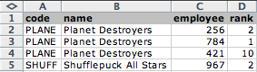
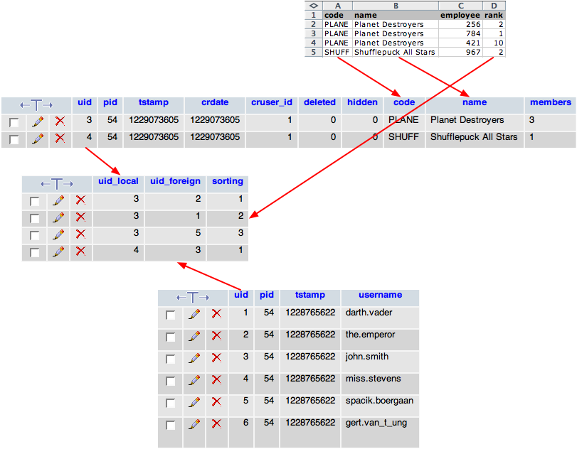

.. include:: /Includes.rst.txt

.. _employees-import-teams:

The teams
^^^^^^^^^

The last data to be imported is the teams. This is mostly like
departments, except that teams have a many-to-many relationship to
employees. Indeed a team will be comprised of several employees and
any employee may be part of several teams.

In this example the incoming data is denormalised. This means that
if team A contains 3 employees, there will be 3 entries for team A,
each with a relationship to a different employee.
Let's look at the example data:

	CSV data in the teams.txt file

We clearly see that the "Planet Destroyers" team appears
three times, because it is comprised of employees 256, 421 and 784.
External import takes this into account by making sure that it keeps a
single copy of each team, based on the external primary key (the
"code" field in this case).

.. note::

   It is also possible to create many-to-many relations with data represented as a
   comma-separated list of keys, commonly used in TYPO3.

In the example data above, you can see that there's a "rank" field.
We want to use it for sorting the many-to-many relations, so we define it
as an additional field (you can look up the TCA for yourself).

The SQL for the teams table is not repeated here as it is quite
standard. The MM-relations table is also an absolutely standard TYPO3
table for MM-relations:

.. code-block:: sql

	CREATE TABLE tx_externalimporttut_teams (
		uid int(11) NOT NULL auto_increment,
		pid int(11) DEFAULT '0' NOT NULL,
		tstamp int(11) DEFAULT '0' NOT NULL,
		crdate int(11) DEFAULT '0' NOT NULL,
		cruser_id int(11) DEFAULT '0' NOT NULL,
		deleted tinyint(4) DEFAULT '0' NOT NULL,
		hidden tinyint(4) DEFAULT '0' NOT NULL,
		code varchar(5) DEFAULT '' NOT NULL,
		name varchar(255) DEFAULT '' NOT NULL,
		members text,

		PRIMARY KEY (uid),
		KEY parent (pid)
	);

The "general" configuration for this import has nothing special about it.
All the action about the many-to-many relations happens in the configuration
of the "members" column:

.. code-block:: php
   :emphasize-lines: 19-28

	$GLOBALS['TCA']['tx_externalimporttut_teams'] = [
           ...
           'columns' => [
                   ...
                   'members' => [
                           'exclude' => 0,
                           'label' => 'LLL:EXT:externalimport_tut/Resources/Private/Language/locallang_db.xlf:tx_externalimporttut_teams.members',
                           'config' => [
                                   'type' => 'group',
                                   'size' => 5,
                                   'internal_type' => 'db',
                                   'allowed' => 'fe_users',
                                   'MM' => 'tx_externalimporttut_teams_feusers_mm',
                                   'maxitems' => 100
                           ],
                           'external' => [
                                   0 => [
                                           'field' => 'employee',
                                           'multipleRows' => true,
                                           'multipleSorting' => 'rank',
                                           'transformations' => [
                                                   10 => [
                                                           'mapping' => [
                                                                   'table' => 'fe_users',
                                                                   'referenceField' => 'tx_externalimporttut_code',
                                                           ],
                                                   ]
                                           ]
                                   ]
                           ]
                   ],
           ],
           ...
	];

What happens here? The "multipleRows" tells External Import that the external data
is denormalised and that this is the column for which it should keep every value,
because they represent many-to-many relations. Each of these values will be mapped
to the "fe\_users" table, according to the defined transformation.

At a later point, the values will be sorted according to the value found in the field
defined with the "multipleSorting" property (in this case "rank"). For each team, the values
(i.e. the "fe\_users" primary keys) are thus sorted and then made into a comma-separated
list for storage by TYPO3.

As a result, only two team records are created in the TYPO3 database instead of 4,
which is what we expect. However the extra rows in the external data have not been
lost and have been used to create the many-to-many relations (of which there are 4,
as expected).

After running the teams import, you should get something like this:

	The team data imported into the database with relations to FE users (members)

We can see that the teams were properly related to the
fe\_users. The sorting has also been kept correctly although with a
renumbering (done automatically by DataHandler).

