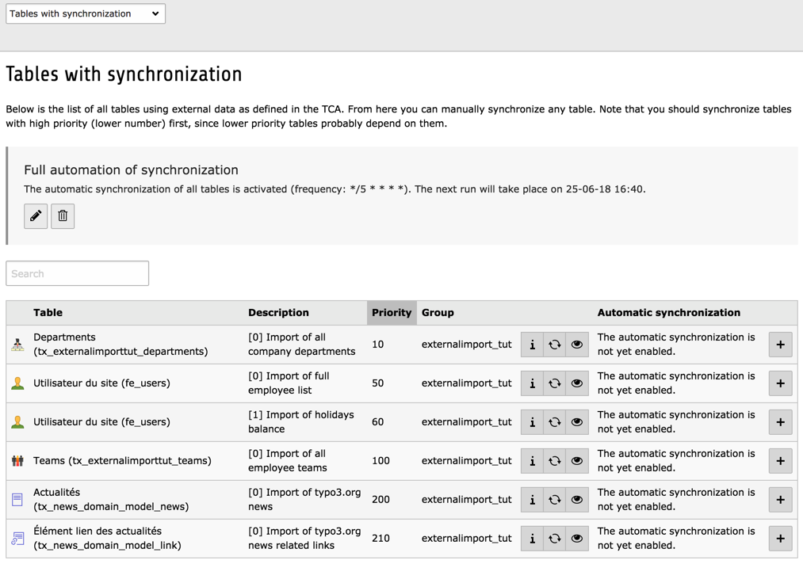

.. ==================================================
.. FOR YOUR INFORMATION
.. --------------------------------------------------
.. -*- coding: utf-8 -*- with BOM.

.. include:: ../Includes.txt

.. _installation:

Installation
------------

This extensions requires the following other extensions:

- external\_import

- news

- svconnector\_csv (which itself requires svconnector)

- svconnector\_feed (ditto)

Upon installation, the extension will create or alter the necessary
tables.

.. _installation-upgrade-140:

Upgrading to 1.4.0
^^^^^^^^^^^^^^^^^^

As of version 1.4.0, this tutorial relies on extension "news" for the
RSS feed import example rather than "tt\_news". If you are upgrading
don't be surprised if your "tt\_news" records don't get updated
anymore upon import. If nothing gets imported, it may be because you
don't have "news" installed.

Nothing serious, just a little something to pay attention to.

.. _installation-verify-configuration:

Verifying the configuration
^^^^^^^^^^^^^^^^^^^^^^^^^^^

To ensure that the records inserted or deleted by the external import
process don't interfere with the other data in your TYPO3
installation, don't forget to properly define a page for storage in
the configuration of the "external\_import" extension
(scroll down to find that option).

.. figure:: ../Images/SettingStoragePage.png
	:alt: Setting a storage page

	Setting the general storage page in the Extension Manager

.. _installation-verify-setup:

Verifying the setup
^^^^^^^^^^^^^^^^^^^

After installation, go to the External Import BE module. It should
look like:

	Checking installed import configurations using the BE module

If you want to follow the process in more details, activate logging at "debug" level.
You can also check what happens in each step by using the Preview mode.
