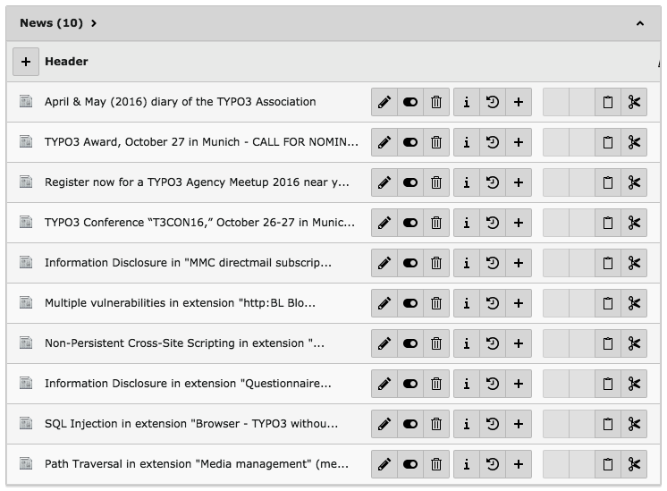

.. ==================================================
.. FOR YOUR INFORMATION
.. --------------------------------------------------
.. -*- coding: utf-8 -*- with BOM.

.. include:: ../../Includes.txt

.. _rss-import-setup:

The external import setup
^^^^^^^^^^^^^^^^^^^^^^^^^

The import of a RSS feed into table :code:`tx_news_domain_model_news`
poses a particular challenge. We want to store the URI of the news
item in the related links table, which uses IRRE and a "parent" field
to relate links to news items.

We will see later what the trick is. The first important thing to
note is the order of import. Since it is links that are related to
news items, we must import news **before** links.

A second peculiarity is that both links and news items are in the
same source of data. Thus we will import the RSS feed twice.

.. _rss-import-setup-news:

Importing news items
""""""""""""""""""""

Thus we start with the news items. A new column was added to the
:code:`tx_news_domain_model_news` table. It is used to store the
external id found in the RSS feed.

Here is the setup for the "ctrl" section:

.. code-block:: php

	$GLOBALS['TCA']['tx_news_domain_model_news']['ctrl']['external'] = array(
		0 => array(
			'connector' => 'feed',
			'parameters' => array(
				'uri' => 'http://typo3.org/xml-feeds/rss.xml'
			),
			'data' => 'xml',
			'nodetype' => 'item',
			'referenceUid' => 'tx_externalimporttut_externalid',
			'enforcePid' => TRUE,
			'disabledOperations' => 'delete',
			'description' => 'Import of typo3.org news'
		),
	);

Note that we don't use the same connector service as before. Indeed,
we now need the "feed" sub-type, which is provided by extension
"svconnector\_feed". This connector is specialized in getting XML data
from some source (remote or local), which is defined with the
:code:`uri` property inside the :code:`parameters` array.

Next, we declare that the data will be provided in XML format and that
the reference node type in "item". With this instruction, External
Import will take all nodes of type "item" and import each of them. The
:code:`enforcePid` property is set to :code:`TRUE` so that the import
takes place only in the predefined page and that existing news items
entered somewhere else are not deleted. This is a useful precaution to
take.

Also note that the delete operation is disabled. This makes sense in
this case, as an RSS feed normally contains only the latest news
items. Thus if you don't want each import to delete the data from the
previous import, the delete operation should be disabled.

Let's now look at the setup for the columns:

.. code-block:: php

	$GLOBALS['TCA']['tx_news_domain_model_news']['columns']['title']['external'] = array(
		0 => array(
			'field' => 'title'
		)
	);
	$GLOBALS['TCA']['tx_news_domain_model_news']['columns']['tx_externalimporttut_externalid']['external'] = array(
		0 => array(
			'field' => 'link'
		)
	);
	$GLOBALS['TCA']['tx_news_domain_model_news']['columns']['datetime']['external'] = array(
		0 => array(
			'field' => 'pubDate',
			'userFunc' => array(
				'class' => 'EXT:external_import/samples/class.tx_externalimport_transformations.php:tx_externalimport_transformations',
				'method' => 'parseDate'
			)
		)
	);
	$GLOBALS['TCA']['tx_news_domain_model_news']['columns']['teaser']['external'] = array(
		0 => array(
			'field' => 'description',
			'trim' => TRUE
		)
	);
	$GLOBALS['TCA']['tx_news_domain_model_news']['columns']['bodytext']['external'] = array(
		0 => array(
			'field' => 'encoded',
			'rteEnabled' => TRUE
		)
	);
	$GLOBALS['TCA']['tx_news_domain_model_news']['columns']['type']['external'] = array(
		0 => array(
			'value' => 0
		)
	);
	$GLOBALS['TCA']['tx_news_domain_model_news']['columns']['hidden']['external'] = array(
		0 => array(
			'value' => 0
		)
	);

For most of the fields, the setup is just as simple as if we were
importing database records, thanks to the connector services, which
have abstracted the tediousness of getting data in different formats.
However XML format allows for more complicated retrieval of data via
the use of XPath or attributes.

The only particular configuration above is for the "bodytext" field,
which uses the "rteEnabled" property to indicate that the content from
this field is rich text and RTE transformations should be applied upon
saving. This helps ensure that such content can be edited correctly in
a RTE-enabled field in the TYPO3 backend, although the varying quality
of available HTML makes it impossible to guarantee a 100% smooth
process.

.. _rss-import-setup-links:

Importing related links
"""""""""""""""""""""""

Next we want to run this import again, to store the links and make
them related to their respective news items. Here is the "ctrl"
section for the :code:`tx_news_domain_model_link`:

.. code-block:: php

	$GLOBALS['TCA']['tx_news_domain_model_link']['ctrl']['external'] = array(
		0 => array(
			'connector' => 'feed',
			'parameters' => array(
				'uri' => 'http://typo3.org/xml-feeds/rss.xml'
			),
			'data' => 'xml',
			'nodetype' => 'item',
			'referenceUid' => 'uri',
			'enforcePid' => TRUE,
			'priority' => 210,
			'disabledOperations' => 'delete',
			'description' => 'Import of typo3.org news related links'
		),
	);

In this case we don't need to add a special field for storing
the external primary key, since we are using the URI and there
is already a field for this.

Now we face slight problem. We want to fill the "parent" column
with the primary key of the related news item, but that field has
no TCA. A field without TCA cannot be manipulated by External Import.
So we need to add a configuration for that field. As we don't need
anything special, we can just give it the
:ref:`passthrough <t3tca:columns-passthrough>` type.

So here is the complete setup, with the special bit highlighted:

.. code-block:: php
   :emphasize-lines: 11-24

	$GLOBALS['TCA']['tx_news_domain_model_link']['columns']['title']['external'] = array(
		0 => array(
			'field' => 'title'
		)
	);
	$GLOBALS['TCA']['tx_news_domain_model_link']['columns']['uri']['external'] = array(
		0 => array(
			'field' => 'link'
		)
	);
	$GLOBALS['TCA']['tx_news_domain_model_link']['columns']['parent'] = array(
		'config' => array(
			'type' => 'passthrough',
		),
		'external' => array(
			0 => array(
				'field' => 'link',
				'mapping' => array(
					'table' => 'tx_news_domain_model_news',
					'reference_field' => 'tx_externalimporttut_externalid'
				)
			)
		)
	);

After running the import, check out the page/folder where the imported
news items are stored. It should look something like this:

	Viewing the imported news records in the BE

